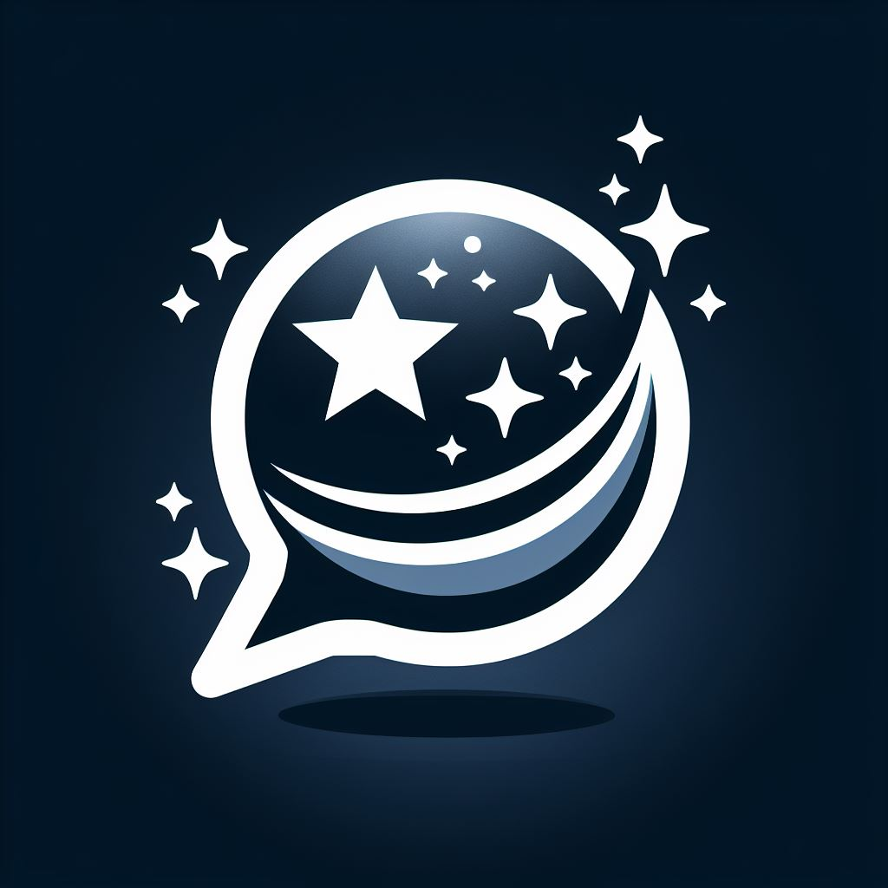

# 🌌 Stellar Chat 🌌

A multi-modal chat application enabling users to create custom agents, and integrate with local LLMs (Local Language Models), as well as OpenAI models, also the capability to generate images, visual recognition capabilities, TTS & STT Voice Conversation, etc.

> \[!NOTE]
>
> This project is part of the ["100 Commits"](https://100commitow.pl/) competition, which challenges participants to commit to their projects by making at least one meaningful commit every day for 100 consecutive days.
>

<kbd>Table of Contents</kbd>

1. [✨ Features](#-features)
   - [`1.` Support for Local Open Source Models](#1-support-for-local-open-source-models)
   - [`2.` Support for Commercial Models](#2-support-for-commercial-models)
   - [`3.` Visual Recognition](#3-visual-recognition)
   - [`4.` Support for TTS & STT](#4-support-for-tts--stt)
   - [`5.` Text to Image Generation](#5-text-to-image-generation)
   - [`6.` Multimodal Chat](#6-multimodal-chat)
   - [`7.` Prompt Store](#7-prompt-store)
   - [`8.` Custom Agent Creation (GPTs)](#8-custom-agent-creation-gpts)
   - [`9.` Message and Conversation Search](#9-message-and-conversation-search)
   - [`10.` Custom Action Creation for App Integration](#10-custom-action-creation-for-app-integration)
   - [`11.` Multi-Agent Chat Capability](#11-multi-agent-chat-capability)
2. [⭐ Enjoying the Project?](#-enjoying-the-project)
3. [🚧 Issues](#-issues)
4. [📝 License](#-license)

## ✨ Features

> \[!IMPORTANT]
>
> **Planned Features**
>
> This is a list of planned features to be implemented in the future. Please note that the list may change over time as the project progresses and new priorities emerge.
>

`1.` Support for Local Open Source Models
Integrate and utilize local open source models through the OLLAMA platform.

`2.` Support for Commercial Models
Easily use commercial models like OpenAI, Gemini, Perplexity, and Claude.

`3.` Visual Recognition
Utilize the powerful visual recognition capabilities of the GPT-4-Vision model and Gemini Vision.

`4.` Support for TTS & STT
Enable text-to-speech (TTS) and speech-to-text (STT) functionalities within the application.

`5.` Text to Image Generation
Generate images from text inputs using advanced models such as Stable Diffusion and DALL-E 3.

`6.` Multimodal Chat
Analyze text, image, and audio files and engage in conversations with uploaded files.

`7.` Prompt Store
Create and manage your own repository of predefined prompts to easily use, modify, and enhance interactions with the models.

`8.` Custom Agent Creation (GPTs)
Easily create and customize your own agents to tailor the interactions and responses according to your specific needs.

`9.` Message and Conversation Search
Easily search through all messages and conversations to quickly find relevant information or previous interactions.

`10.` Custom Action Creation for App Integration
Create custom actions to seamlessly integrate with your favorite applications such as Gmail, Todoist, Spotify, and more, enhancing productivity and workflow efficiency.

`11.` Multi-Agent Chat Capability
Engage in conversations with multiple agents simultaneously within a single chat interface, enabling diverse interactions and enhanced collaboration.

## ⭐ Enjoying the Project?

If you find this project helpful, learned something new, or using it to kickstart your own solution, consider showing your appreciation by giving it a star! Your support means a lot. Thank you! 🚀

## 🚧 Issues

If you have discovered a bug or having some issues, please let me know by [reporting a new issue](https://github.com/ktutak1337/Stellar-Chat/issues?state=open).

## 📝 License

This project is licensed under the MIT License - see the [LICENSE](https://github.com/ktutak1337/Stellar-Chat/blob/main/LICENSE.md) file for details.
